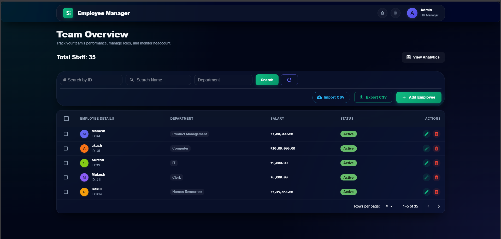
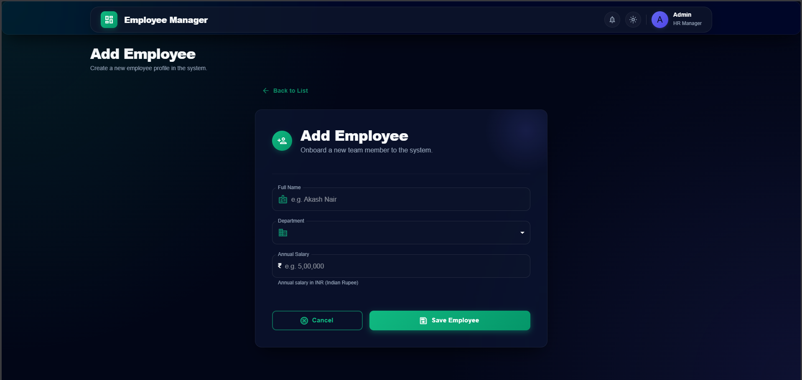
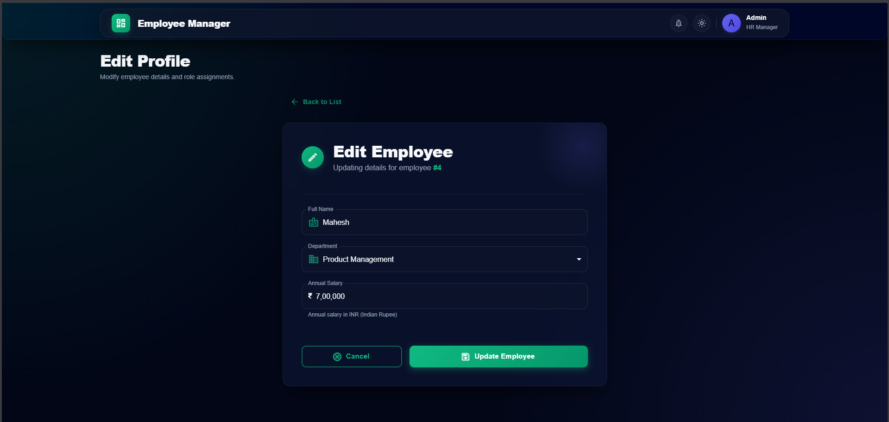
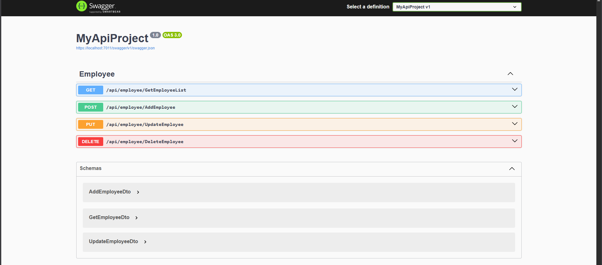

# Employee Management System

A full-stack Employee Management System built using **ASP.NET Core Web API**, **ADO.NET**, **SQL Server**, and a modern **Vite-based frontend**.  
The project demonstrates a clean layered backend architecture with stored procedures and a separated frontend structure.

---

## Features

- Create, update, delete employees
- Fetch employee list with filters
- Backend layered architecture (Controller → Business → Data Access)
- Stored procedure based database operations
- Parameterized queries to prevent SQL injection
- Clear separation of frontend, backend, and database

---

## Tech Stack

### Backend
- ASP.NET Core Web API
- ADO.NET
- SQL Server
- Stored Procedures

### Frontend
- Vite
- JavaScript
- HTML / CSS

### Database
- SQL Server
- SQL script for schema and procedures

---

## Project Structure

```
EmployeeManagementSystem
│
├── backend/
│ └── MyApiProject/
│ ├── Controllers/
│ ├── Business/
│ ├── DataAccess/
│ ├── Models/
│ ├── appsettings.json
│ ├── Program.cs
│ └── MyApiProject.csproj
│
├── frontend/
│ └── employee-ui/
│
├── database/
│ └── EmployeeManagement.sql
│
├── .gitignore
└── README.md
```


---

## Database Setup

This project uses **SQL Server**.

### Steps
1. Open SQL Server Management Studio (SSMS)
2. Run the SQL script:
3. The script will:
- Create the database if it does not exist
- Create the `Employee` table
- Create all required stored procedures

---

## Backend Setup

### Prerequisites
- .NET 6 or later
- SQL Server
- Visual Studio or VS Code

### Steps
1. Navigate to the backend project:

2. Update the connection string in `appsettings.json`:
```
"ConnectionStrings": {
  "DefaultConnection": "Server=.;Database=EmployeeManagementDB;Trusted_Connection=True;"
}
```

3. Run the API:
`dotnet run`


4. API base URL:
`http://localhost:5000`


5. Swagger (if enabled):
`http://localhost:5000/swagger`

## Frontend Setup
### Prerequisites
- Node.js (v18+ recommended)

Steps
```
cd frontend/employee-ui
npm install
npm run dev
```


Frontend will be available at:
`http://localhost:5173`

## API Endpoints

| Operation       | Method | Endpoint        |
|-----------------|--------|-----------------|
| Get Employees   | GET    | /api/employee   |
| Add Employee    | POST   | /api/employee   |
| Update Employee | PUT    | /api/employee   |
| Delete Employee | DELETE | /api/employee   |


Design Notes

- Backend uses ADO.NET instead of ORM for better SQL control
- All database access is handled through stored procedures
- Parameterized queries are used to avoid SQL injection
- Database files are not committed, only schema and procedures are provided

## Application Screenshots

### Employee List


### Add Employee


### Edit Employee


### Swagger API

